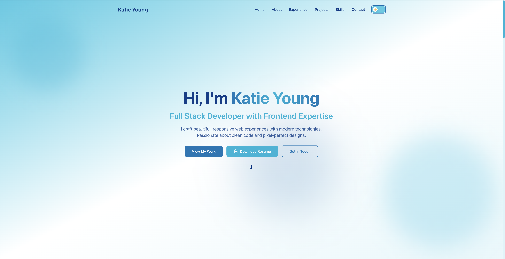

# Portfolio Website

A modern, responsive portfolio website built with React, TypeScript, and Tailwind CSS. Features smooth animations, dark mode, and a clean design to showcase my work and experience.

## 🌐 Live Demo

[View Live Site](https://cheshirekate8.github.io)

## ✨ Features

- 🎨 **Modern Design** - Clean, professional interface with a cohesive blue color scheme
- 🌓 **Dark Mode** - Toggle between light and dark themes with persistent preference
- ⚡ **Smooth Animations** - Powered by Framer Motion for engaging user experience
- 📱 **Fully Responsive** - Optimized for mobile, tablet, and desktop devices
- 🚀 **Fast Performance** - Built with Vite for lightning-fast load times
- ♿ **Accessible** - Keyboard navigation and screen reader friendly
- 📊 **Scroll Progress** - Visual indicator showing page scroll position
- 🎯 **Interactive Projects** - Filterable project showcase with live demos

## 🛠️ Technologies

- **Frontend:** React 18, TypeScript
- **Styling:** Tailwind CSS
- **Animations:** Framer Motion
- **Build Tool:** Vite
- **Deployment:** GitHub Pages
- **Version Control:** Git & GitHub

## 📬 Contact

- **Email:** katie.f.young@me.com
- **LinkedIn:** [linkedin.com/in/dev-katie-young](https://linkedin.com/in/dev-katie-young)
- **GitHub:** [github.com/cheshirekate8](https://github.com/cheshirekate8)

## ✅ To Do
- Navbar
  - Fix on mobile
- General
  - Change SVG to icons where possible
  - Combine socials and personal info data types
  - Actually use all the data in the data folder instead of hard coding it
  - Remove all commented code
- About
  - Icon colors for light and dark mode
  - Change "technologies I work with" to "my favorite languages"
- Projects
  - Fix languages text color
  - If portfolio, remove live demo button
  - CAHDB
    - Image
    - Data
    - Finish and Deploy CAHDB (last to do)
- LATER (hidden code)
  - Hero
    - Rewrite copy
  - Skills
    - Redo Always Learning section